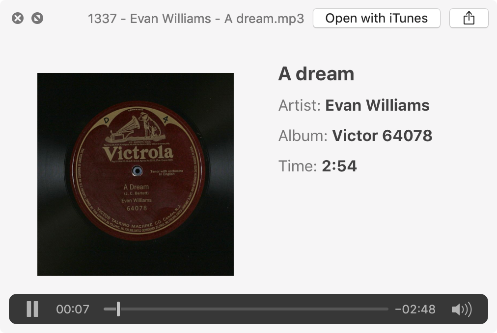

# `locdown` - The Library of Congress Downloader

`locdown` is a command-line tool that can fetch audio and scrape metadata from
[the Library of Congress Jukebox](https://www.loc.gov/jukebox).

## Background

The Library of Congress website has a "Jukebox" section that provides free
access to over ten thousand tracks of historically significant music ---
unfortunately, it requires Adobe Flash to play audio. Virtually all modern
browsers block Flash by default, some don't support it at all, and many people
(myself included) actively avoid Flash for privacy and security reasons. As
such, the majority of Americans today will find themselves unable to use the
core functionality of the Jukebox, which in my mind flies in the face of its
stated goal "to present _to the widest audience possible_ early commercial
sound recordings" (emphasis mine).

I designed `locdown` as an alternative interface to the LoC Jukebox website.
The tool simply takes the information that's already on the site and reformats
it in a more open and accessible way.

`locdown` has three modes.

- **Stream** Jukebox recordings in the operating system's native
  media player. A player with RTMP support is required;
  [VLC](https://www.videolan.org/vlc/index.html) is a popular choice.
- **Scrape** recording information in JSON format, including links to
  related pages (e.g. those of the musicians, composer, and lyricist), which
  can be helpful for academic cross-referencing.
- **Download** recordings to a file and tag them with details scraped from
	the website (*if you have permission to do so*; see the legal disclaimer below).

## Usage

```
usage: locdown [-h] [-m MAX_CONNECTIONS] action ...

Fetch audio and metadata from the Library of Congress Jukebox
(https://www.loc.gov/jukebox).

positional arguments:
  action
    stream              Stream audio in your OS's local media player.
    scrape              Scrape audio metadata.
    download            Download audio.

optional arguments:
  -h, --help            show this help message and exit
  -m MAX_CONNECTIONS, --max-connections MAX_CONNECTIONS
                        The maximum number of simultaneous connections to
                        make. Defaults to 10.
```

### Stream mode

```
usage: locdown stream [-h] [-b BITRATE] [-p] recording [recording ...]

positional arguments:
  recording             The recording(s) to stream.

optional arguments:
  -h, --help            show this help message and exit
  -b BITRATE, --bitrate BITRATE
                        Desired bitrate, in kbps. Can be 128 or 320. Defaults to 320.
  -p, --print           Print stream URLs instead of opening them.
```

### Scrape mode

```
usage: locdown scrape [-h] [-s] [-d DEST] recording [recording ...]

positional arguments:
  recording             The recording(s) to scrape.

optional arguments:
  -h, --help            show this help message and exit
  -s, --save-json       Save individual JSON data files for each recording instead of printing.
  -d DEST, --dest DEST  Destination directory for downloaded data files. Use with the -s flag.
```

### Download mode

```
usage: locdown download [-h] [-d DEST] [-b BITRATE] [-t] [-a] [-p] [-s]
                        [--disclaimer]
                        recording [recording ...]

positional arguments:
  recording             The recording(s) to download.

optional arguments:
  -h, --help            show this help message and exit
  -d DEST, --dest DEST  Destination directory for downloaded recordings and data files.
  -b BITRATE, --bitrate BITRATE
                        Desired bitrate (128 or 320). Defaults to 320.
  -t, --tag             Tag the downloaded recording(s).
  -a, --art             Download album art, if available, and embed it in the recording(s).
  -p, --print           Print JSON data for the recording(s); same as the `scrape` action.
  -s, --save-json       Save individual JSON data files alongside each recording.
  --disclaimer          Show the disclaimer displayed when download mode is first used.
```

### Recording and Artist IDs

The recordings on which to operate can be specified in numerous ways. Any number
of the following ID formats (separated by spaces) can be provided in the
`recordings...` argument of all three modes.

1. The URL of the details page for a recording:
   `https://loc.gov/jukebox/recordings/detail/id/1234`
2. The ID found in the details page URL: `1234`
3. A dash-separated range of IDs: `100-120`
4. One or more randomly-selected IDs: `randomN` for `N` IDs, e.g. `random10`. `random1` can be abbreviated as `random`.

## Examples

Fetching and tagging a track, including album art, and saving a JSON file
containing scraped information.

```
$ locdown download --tag --art --save-json --dest /tmp 1234
Downloading 1 recording...
1/1 (100%) complete

# Files created:
#   /tmp/1234 - Antonio Scotti - Brindisi, Inaffia i'ugola.json
#   /tmp/1234 - Antonio Scotti - Brindisi, Inaffia i'ugola.mp3
```



Scraping JSON-formatted data for the track shown above:

```
$ locdown scrape 1337
[
  {
    "Artists": {
      "Composer": [
        {
          "Link": "https://www.loc.gov/jukebox/artists/detail/id/1606",
          "Name": "J. C. Bartlett"
        }
      ],
      "Lyricist": [
        {
          "Link": "https://www.loc.gov/jukebox/artists/detail/id/1605",
          "Name": "Charles B. Cory"
        }
      ],
      "Tenor vocal": [
        {
          "Link": "https://www.loc.gov/jukebox/artists/detail/id/1152",
          "Name": "Evan Williams"
        }
      ]
    },
    "Category": "Vocal",
    "Description": "Tenor vocal solo, with orchestra",
    "Duration": "02:54",
    "Genre(s)": "Classical music",
    "Image Link": "https://www.loc.gov/jukebox/media/take/images/ucsb_victor_64078_01_b4864_15.jpg",
    "Jukebox ID": 1337,
    "Label Name/Number": "Victor 64078",
    "Language": "English",
    "Link": "https://www.loc.gov/jukebox/recordings/detail/id/1337/",
    "Matrix Number/Take Number": "B-4864/15",
    "Notes": "EDVR vol. II notes that take 1 was listed as by William T. Evans in the recording books, which may indicate it was originally scheduled for Black Label release, but it was issued as a Red Seal and by Evan Williams.",
    "Place of Recording": "Camden, New Jersey",
    "Recording Date": "1913-12-18",
    "Recording Title": "A dream",
    "Size": "10\""
  }
]
```

## Disclaimer

_`locdown` requires the user to accept the terms of following disclaimer before
using download mode._


locdown's download functionality is intended for legal use only. The Library of
Congress posts the following notice on the details page of each recording:

> This recording is protected by state copyright laws in the United States. The
> Library of Congress has obtained a license from rights holders to offer it as
> streamed audio only. Downloading is not permitted. The authorization of
> rights holders of the recording is required in order to obtain a copy of the
> recording. Contact jukebox@loc.gov for more information.

If you use locdown to download a track from the Library of Congress Jukebox,
it must be the case that either
 (a) its rights holders have authorized you to do so, or
 (b) you know that it is no longer under copyright.

This disclaimer can be displayed at any time by running
`locdown download --disclaimer`.
